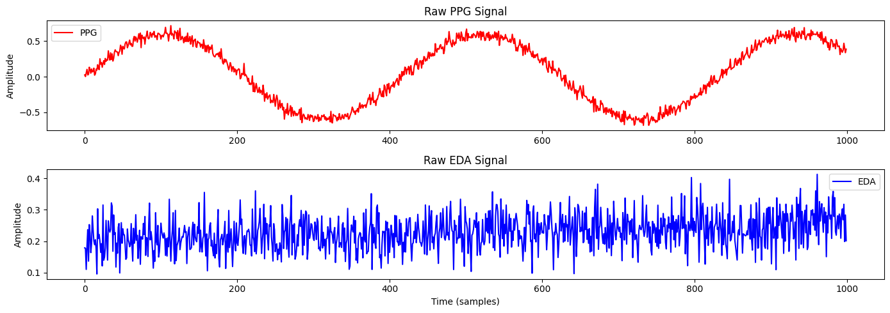
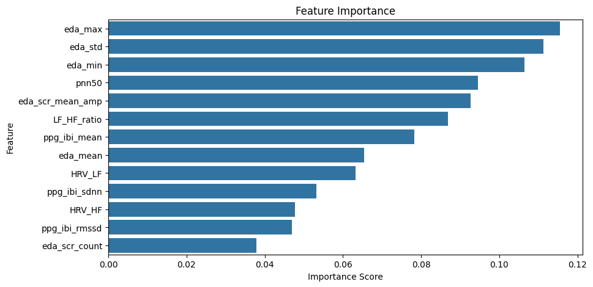
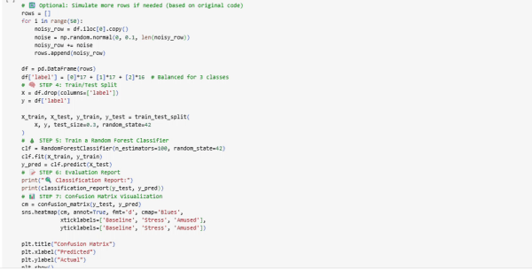

# 🧠 Multimodal Stress Detection Using PPG and EDA

This project is a complete end-to-end pipeline for detecting human stress levels using physiological signals — specifically, **PPG (Photoplethysmography)** and **EDA (Electrodermal Activity)**. It covers everything from raw signal inspection to feature extraction and machine learning model training.

[](https://colab.research.google.com/github/Reem-Aboutaleb/multimodal-stress-detection/blob/main/01_Load_Data.ipynb)

---


---

> 🧠 **Keywords**: Stress Detection, PPG, EDA, HRV, Biomedical Signal Processing, Python, Machine Learning, NeuroKit2, Feature Extraction, Streamlit-ready

---

## 📚 Table of Contents

- [Overview](#-multimodal-stress-detection-using-ppg-and-eda)
- [Project Structure](#-project-structure)
- [Dataset](#-dataset)
- [Technologies Used](#-technologies-used)
- [Features Extracted](#-features-extracted)
- [Model](#-model)
- [Results (Advanced Features)](#-results-advanced-features)
- [How to Run This Project](#-how-to-run-this-project)
- [Ready for Real-World Use](#-ready-for-real-world-use)
- [Future Work](#-future-work)
- [Key Takeaways](#-key-takeaways)
- [Author](#-author)

---

## 📂 Project Structure

```bash
multimodal-stress-detection/
├── 01_Load_Data.ipynb
├── 02_Preprocess_Signals_PPG_EDA.ipynb
├── 03_Feature_Extraction.ipynb
├── 04_Model_Training.ipynb
├── images/
│   ├── signal_preview.png
│   ├── confusion_matrix_advanced.png
│   └── feature_importance_advanced.png
├── extracted_features.csv
├── sample_signals.csv
└── README.md
```

---

## 🧪 Dataset

We use a **simulated biosignal dataset** that mimics the structure of real-world data from the WESAD dataset.  
It includes three labeled conditions for stress classification:

- `0`: Baseline  
- `1`: Stress  
- `2`: Amusement

This project architecture is built to scale seamlessly with real biosignal datasets like WESAD, UBFC, or data from wearable devices.

---

## ⚙️ Technologies Used

- Python 3.11  
- Pandas, NumPy, SciPy  
- Scikit-learn, Seaborn, Matplotlib  
- Google Colab / Jupyter Notebooks

---

### 📉 Sample Biosignals



---

## 💡 Features Extracted

**From PPG:**
- IBI Mean  
- SDNN (Standard Deviation of NN intervals)  
- RMSSD (Root Mean Square of Successive Differences)

**From EDA:**
- Mean  
- Standard Deviation  
- Max  
- Min

---

## 🤖 Model

We train a **Random Forest Classifier** to predict the stress state from extracted physiological features.  
Evaluation is done using a **confusion matrix** and **classification report**.

---

## 📊 Results (Advanced Features)

The model was retrained using **advanced features** extracted from PPG and EDA signals, including:

- 💓 `pNN50`, `HRV_LF`, `HRV_HF`, `LF/HF Ratio`  
- 💧 `SCR peak count`, `mean SCR amplitude`, and statistical EDA metrics

These enhancements improve the model's understanding of autonomic stress response and offer better feature interpretation.

### 📋 Performance Metrics Summary

| Model                | Accuracy | F1 Score | Training Time (s) |
|----------------------|----------|----------|--------------------|
| Random Forest        | 46.6%    | 0.426    | 0.44               |
| K-Nearest Neighbors  | 46.6%    | 0.406    | 0.02               |
| Logistic Regression  | 33.3%    | 0.237    | 0.09               |
| SVM (RBF Kernel)     | 33.3%    | 0.243    | 0.01               |

### 🔽 Confusion Matrix (Advanced)


### 🔽 Feature Importance (Advanced)


> 💬 These scores are expected to improve significantly with real-time data or clinical datasets like **WESAD**.

---

## 📈 How to Run This Project

1. Open the notebooks in order:
   - `01_Load_Data.ipynb`
   - `02_Preprocess_Signals_PPG_EDA.ipynb`
   - `03_Feature_Extraction.ipynb`
   - `04_Model_Training.ipynb`
2. Upload the CSV files when prompted  
3. Run each cell in order inside each notebook

---

## 🎥 Demo

Here’s a quick preview of the project in action:



---

## 📦 Ready for Real-World Use

This project is designed for scalability and real-life clinical applications. It can be extended to:

- Work with real-world datasets from wearables like Empatica E4  
- Integrate into a **Streamlit** dashboard for real-time visualizations  
- Serve as a stress monitoring prototype for healthcare R&D

---

## 🔭 Future Work

- Integrate real-time data ingestion from wearable biosensors  
- Add emotion classification beyond stress (e.g., relaxation, engagement)  
- Test with open-source datasets like WESAD, DEAP, or PhysioNet  
- Deploy as a mini web app using Streamlit or Flask

---

## 🧠 Key Takeaways

- Practiced biomedical signal processing using Python  
- Learned HRV and EDA feature engineering for stress modeling  
- Compared multiple classification models and visualized results  
- Improved my end-to-end project structuring for health tech

---

## 💖 Author

Created by **Reem Aboutaleb** — Biomedical Engineering M.S. Candidate at NYU Tandon School of Engineering 💡  
Specializing in biomedical signal processing, machine learning, and clinical technology.

📧 Contact: Reemwalid222@gmail.com  
🔗 [GitHub Portfolio](https://github.com/Reem-Aboutaleb) | [LinkedIn](https://www.linkedin.com/in/reem-aboutaleb)


