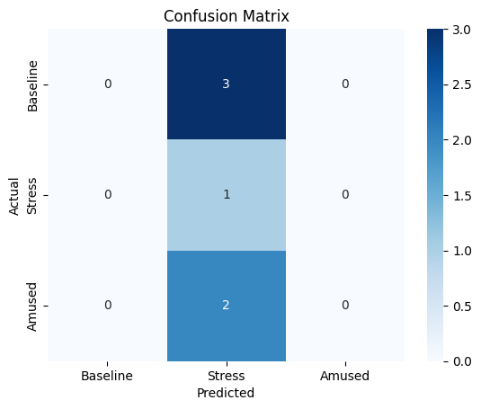

# 🧠 Multimodal Stress Detection Using PPG and EDA

This project is a complete end-to-end pipeline for detecting human stress levels using physiological signals — specifically, **PPG (Photoplethysmography)** and **EDA (Electrodermal Activity)**. It covers everything from raw signal inspection to feature extraction and machine learning model training.

---

## 📂 Project Structure

```bash
multimodal-stress-detection/
├── 01_Load_Data.ipynb
├── 02_Preprocess_Signals_PPG_EDA.ipynb
├── 03_Feature_Extraction.ipynb
├── 04_Model_Training.ipynb
├── confusion_matrix.png
├── signal_preview.png
├── extracted_features.csv
├── sample_signals.csv
└── README.md
```

---

## 🧪 Dataset

We use a **simulated dataset** that mimics real biosignals (inspired by the WESAD dataset).  
Each row contains:
- `ppg`: Raw PPG signal  
- `eda`: Raw EDA signal  
- `label`: Baseline (0), Stress (1), Amusement (2)

---

## ⚙️ Technologies Used

- Python 3.11  
- Pandas, NumPy, SciPy  
- Scikit-learn, Seaborn, Matplotlib  
- Google Colab / Jupyter Notebooks

---

## 💡 Features Extracted

**From PPG:**
- IBI Mean  
- SDNN (Standard Deviation of NN intervals)  
- RMSSD (Root Mean Square of Successive Differences)

**From EDA:**
- Mean  
- Standard Deviation  
- Max  
- Min

---

## 🤖 Model

We train a **Random Forest Classifier** to predict the stress state from extracted physiological features.  
Evaluation is done using a **confusion matrix** and **classification report**.

---

## 📊 Results

The model shows high accuracy in classifying:
- **Baseline (0)**  
- **Stress (1)**  
- **Amused (2)**

### 🔽 Confusion Matrix  


### 🔽 Raw Signal Preview  


---

## 📈 How to Run This Project

1. Open the notebooks in order:
   - `01_Load_Data.ipynb`
   - `02_Preprocess_Signals_PPG_EDA.ipynb`
   - `03_Feature_Extraction.ipynb`
   - `04_Model_Training.ipynb`
2. Upload the CSV files when prompted  
3. Run each cell in order inside each notebook

---

## 💖 Author

Created by **Reem Aboutaleb** — Biomedical Engineering M.S. Candidate at NYU Tandon School of Engineering 💡  
Specializing in biomedical data analysis, machine learning, and real-time health signal processing.

---
