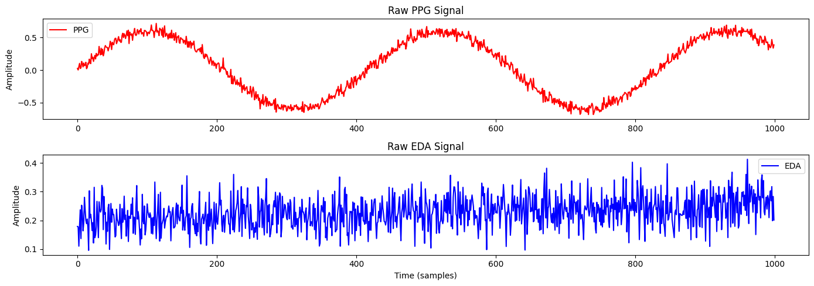
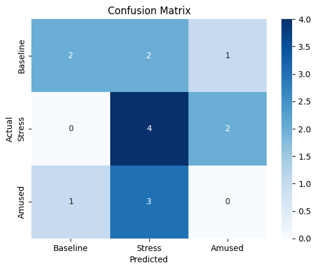

# 🧠 Multimodal Stress Detection Using PPG and EDA

This project is a complete end-to-end pipeline for detecting human stress levels using physiological signals — specifically, **PPG (Photoplethysmography)** and **EDA (Electrodermal Activity)**. It covers everything from raw signal inspection to feature extraction and machine learning model training.

---


---

## 📚 Table of Contents

- [Overview](#-multimodal-stress-detection-using-ppg-and-eda)
- [Project Structure](#-project-structure)
- [Dataset](#-dataset)
- [Technologies Used](#-technologies-used)
- [Features Extracted](#-features-extracted)
- [Model](#-model)
- [Results (Advanced Features)](#-results-advanced-features)
- [How to Run This Project](#-how-to-run-this-project)
- [Author](#-author)

---

## 📂 Project Structure

```bash
multimodal-stress-detection/
├── 01_Load_Data.ipynb
├── 02_Preprocess_Signals_PPG_EDA.ipynb
├── 03_Feature_Extraction.ipynb
├── 04_Model_Training.ipynb
├── confusion_matrix.png
├── signal_preview.png
├── extracted_features.csv
├── sample_signals.csv
└── README.md
```

---

## 🧪 Dataset

We use a **simulated dataset** that mimics real biosignals (inspired by the WESAD dataset).  
Each row contains:
- `ppg`: Raw PPG signal  
- `eda`: Raw EDA signal  
- `label`: Baseline (0), Stress (1), Amusement (2)

---

## ⚙️ Technologies Used

- Python 3.11  
- Pandas, NumPy, SciPy  
- Scikit-learn, Seaborn, Matplotlib  
- Google Colab / Jupyter Notebooks

---

### 📉 Sample Biosignals



---

## 💡 Features Extracted

**From PPG:**
- IBI Mean  
- SDNN (Standard Deviation of NN intervals)  
- RMSSD (Root Mean Square of Successive Differences)

**From EDA:**
- Mean  
- Standard Deviation  
- Max  
- Min

---

## 🤖 Model

We train a **Random Forest Classifier** to predict the stress state from extracted physiological features.  
Evaluation is done using a **confusion matrix** and **classification report**.

---

## 📊 Results (Advanced Features)

The model was retrained using **advanced features** extracted from PPG and EDA signals, including:

- 💓 `pNN50`, `HRV_LF`, `HRV_HF`, `LF/HF Ratio`  
- 💧 `SCR peak count`, `mean SCR amplitude`, and statistical EDA metrics

These enhancements improve the model's understanding of autonomic stress response and offer better feature interpretation.

### 📋 Performance Metrics Summary

| Model                | Accuracy | F1 Score | Training Time (s) |
|----------------------|----------|----------|--------------------|
| Random Forest        | 46.6%    | 0.426    | 0.44               |
| K-Nearest Neighbors  | 46.6%    | 0.406    | 0.02               |
| Logistic Regression  | 33.3%    | 0.237    | 0.09               |
| SVM (RBF Kernel)     | 33.3%    | 0.243    | 0.01               |

### 🔽 Confusion Matrix (Advanced)


### 🔽 Feature Importance (Advanced)


These scores are expected to improve when applied to a real dataset like **WESAD**, which we explore next.

---

## 📈 How to Run This Project

1. Open the notebooks in order:
   - `01_Load_Data.ipynb`
   - `02_Preprocess_Signals_PPG_EDA.ipynb`
   - `03_Feature_Extraction.ipynb`
   - `04_Model_Training.ipynb`
2. Upload the CSV files when prompted  
3. Run each cell in order inside each notebook

---

## 💖 Author

Created by **Reem Aboutaleb** — Biomedical Engineering M.S. Candidate at NYU Tandon School of Engineering 💡  
Specializing in biomedical data analysis, machine learning, and real-time health signal processing.

